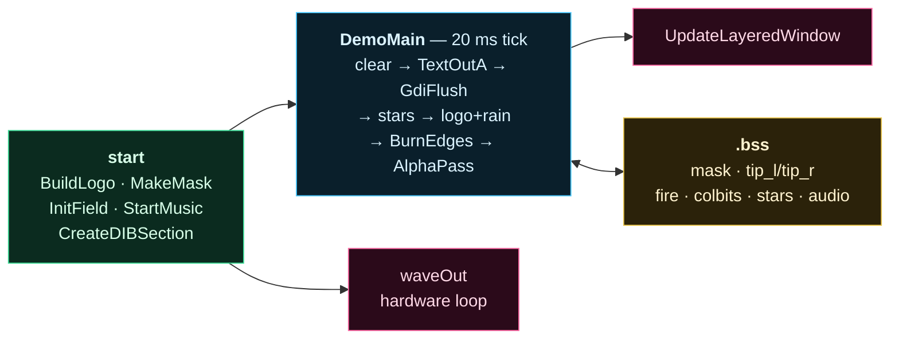

# FREDGIS

A 1990s style cracktro for Windows x64, written in **pure NASM assembly**.
No C, no runtime library, no framework, no external asset: **7 168 bytes** on
disk, four system DLLs, one source file — graphics *and* a chiptune.

<p align="center">
  
</p>

The window is not a rectangle. It is a stack of horizontal planks whose torn
ends burn away into grey ash and green blue embers, and the whole thing is
see-through, so the desktop stays visible behind it. Every pixel — the letters,
the fire, the stars, the transparency — is rasterised by hand into a memory
bitmap, and the music is synthesised sample by sample into a byte array.

Sound only: [`docs/tune.wav`](docs/tune.wav) · with picture:
[`docs/fredgis.mp4`](docs/fredgis.mp4)

---

## Contents

| File | Purpose |
| --- | --- |
| `fredgis.asm` | The whole demo. ~1 450 lines of NASM, 26 imported symbols. |
| `tiny.ld` | Custom linker script that discards every section the linker emits by default and that this program has no use for. |
| `build.ps1` | One command build. |
| `docs/` | Screenshots, the animated capture and the soundtrack. |

## Build

You need [NASM](https://www.nasm.us/) and the `ld` from a **mingw-w64**
toolchain, both on `PATH`.

```powershell
.\build.ps1
```

Or by hand:

```powershell
$lib = Join-Path (Split-Path (Split-Path (Get-Command ld).Source)) "x86_64-w64-mingw32\lib"
nasm -Ox -f win64 fredgis.asm -o fredgis.o
ld -mi386pep --subsystem windows -e start -s -T tiny.ld -o fredgis.exe `
   fredgis.o "-L$lib" -lkernel32 -luser32 -lgdi32 -lwinmm
```

`ld` is used only as a PE writer and import table generator. No startup object
and no support library is linked in: `start` is the raw entry point the loader
jumps to, and the process ends with `ExitProcess`.

## Run

```powershell
.\fredgis.exe
```

* **Drag anywhere** to move the window — there is no title bar.
* **Escape** to quit.

Every launch is different: the plank silhouette, the starfield and the fire are
all seeded from `GetTickCount`.


---

# Architecture



There is no engine and no abstraction layer: one source file, one 16 ms loop,
and three tables of bytes that every effect reads from or writes to.

---

# How it works

## 1. The window is a bitmap, not a window

An irregular outline with *soft* edges cannot be done with a region —
`SetWindowRgn` is 1-bit, so it can only cut hard shapes. So the demo is a
`WS_EX_LAYERED` window that is never painted by `WM_PAINT`. Instead we own a
32 bpp DIB and hand it to the compositor whole:

```nasm
    call BurnEdges
    call AlphaPass

    mov rcx, qword [rsp + 80]           ; hand the surface to the compositor
    xor edx, edx
    xor r8d, r8d
    lea r9, [ulw_size]
    mov rax, qword [rsp + 88]
    mov qword [rsp + 32], rax
    lea rax, [ulw_src]
    mov qword [rsp + 40], rax
    mov qword [rsp + 48], 0
    lea rax, [ulw_blend]
    mov qword [rsp + 56], rax
    mov qword [rsp + 64], ULW_ALPHA
    call UpdateLayeredWindow
```

The surface comes from `CreateDIBSection` with a **negative height**, which
makes it top-down, so the memory is a plain `B,G,R,A` array and a dword reads
naturally as `0x00RRGGBB`.

There is no double buffering, no `BitBlt` and no device context involved in
presenting: `UpdateLayeredWindow` *is* the swap.

## 2. `AlphaPass` — the compositor

This is the heart of the demo, and the two rules that govern it are easy to get
wrong:

**GDI never writes the alpha byte.** Anything `TextOutA` touches comes back with
`A = 0`. So `AlphaPass` runs last and is the sole owner of the alpha channel —
and it must run *after* `GdiFlush`, because GDI batches its calls and would
otherwise stomp on pixels we already composited.

**Alpha must be premultiplied.** `UpdateLayeredWindow` with `ULW_ALPHA` expects
`channel = channel * a >> 8`:

```nasm
    mov edx, dword [r14 + rcx * 4]      ; premultiply the three channels
    movzx r8d, dl
    imul r8d, eax
    shr r8d, 8
    shr edx, 8
    movzx r9d, dl
    imul r9d, eax
    shr r9d, 8
    shr edx, 8
    movzx edx, dl
    imul edx, eax
    shr edx, 8
    shl edx, 16
    shl r9d, 8
    or edx, r9d
    or edx, r8d
    shl r10d, 24                        ; alpha keeps the untouched coverage
    or edx, r10d
    mov dword [r14 + rcx * 4], edx
```

Nothing in the demo ever reaches alpha 255. The coverage tops out at
`GLOBAL_A = 196`, which is what makes the whole window see-through:

```nasm
%define GLOBAL_A            196          ; nothing is fully solid: the desktop
                                         ; stays clearly visible through it all
```

## 3. `MakeMask` — the plank silhouette

Six planks of 45 rows. Each one picks how deep it tears on the left and on the
right, independently, so no two ends line up:

```nasm
    call NextRand
    and eax, 15
    imul eax, eax, 4                    ; 10..TIP_MAX: the planks must end at
    add eax, 10                         ; clearly different depths or the
    mov r14d, eax                       ; silhouette reads as a rectangle
```

The fade width is the constant `PLANK_FADE = 64`. Making it a power of two
turns the `t = d / fade` division into a single shift, which is the difference
between a `cdq` + `idiv` pair and one instruction:

```nasm
    cmp eax, PLANK_FADE
    jge .left_full
    shl eax, 2                          ; t = d/PLANK_FADE in 0..256, a shift
    call SmoothStep                     ; because the width is a power of two
```

The curve is **smoothstep**, `3t² − 2t³`, in fixed point. This was the third
attempt. A linear ramp is mathematically smooth but reads as a straight edge.
A plain square is *worse*: its slope is steepest exactly where it meets the
solid core, which is the hard line we were trying to remove in the first place.
Smoothstep is flat at both ends, so the plank melts into the fire with no seam:

```nasm
SmoothStep:
    mov edx, eax
    imul eax, eax
    shr eax, 8                          ; s = t^2 / 256
    imul edx, eax                       ; s * t
    shr edx, 7                          ; 2 * s * t / 256
    lea eax, [rax + rax * 2]            ; 3s
    sub eax, edx
    imul eax, GLOBAL_A
    shr eax, 8
    ret
```

It runs once, at startup, so the `call` sitting in the inner loop costs nothing
at runtime.

## 4. `BurnEdges` — the fire

A Doom style fire rotated 90°, anchored to each plank's own tip rather than to
a fixed column, propagating outwards over `FIRE_W = 176` pixels. The inner loop
runs 2 × 270 × 176 times per frame, so the RNG is inlined rather than called:

```nasm
    imul r15d, r15d, 1103515245         ; inline LCG, no call in these loops
    add r15d, 12345
```

The source is not on the tip itself. It sits `FLAME_IN = 72` pixels *inside*
the solid core, which is more than the 64 pixel alpha ramp. Putting it on the
tip leaves the whole fade region with no fire in it — a bare gradient, and your
eye reads a bare gradient as a straight edge.

Each row has its own heat that random-walks every frame. The bias matters more
than it looks:

```nasm
    and eax, 127
    sub eax, 63                         ; near unbiased walk: without this the
                                        ; rows all pin to 255 and the fire turns
                                        ; into a flat band instead of tongues
```

But an independent walk per row is *vertically uncorrelated*, which renders as
fine static. Diffusing the heat along y a little every frame builds up the
correlation that turns static into tongues of different lengths:

```nasm
    mov r9d, 2
.smooth_pass:
    movzx r8d, byte [r10]               ; previous row, clamped at the top
    xor r12d, r12d
.smooth:
    movzx eax, byte [r10 + r12]
    lea edx, [r12 + 1]
    cmp edx, SCR_H
    jb .sm_next
    mov edx, r12d
.sm_next:
    movzx edx, byte [r10 + rdx]
    add edx, r8d
    lea edx, [rdx + rax * 2]
    shr edx, 2
    mov r8d, eax                        ; the neighbour must stay unsmoothed
    mov byte [r10 + r12], dl
```

Propagation outwards cools each step by a random amount. The mask is small
(`0..3`, so 1.5 per step on average) and it is tuned: a 255 source dies after
roughly 170 steps, just short of the 176 pixel band, so the fire fades out on
its own instead of being cut off at the boundary:

```nasm
    movzx r8d, byte [r14 + rdx - 1]     ; heat of the column one step in
    shr eax, 6
    and eax, 3                          ; gentle cooling: the tongues reach far
    sub r8d, eax
    jns .cool_ok
    xor r8d, r8d
```

The last piece, and the one that finally killed the hard edges, is that the
fire is **faded in** over its first 64 columns. Starting at full source heat on
column 0 draws a perfectly straight vertical line — a hard black to green seam
exactly where the plank body ends. Ramping the heat up instead makes the body
grade black → ash → ember with nothing straight anywhere:

```nasm
    cmp edx, FLAME_RISE                 ; fade the fire in as it comes out of
    jae .flame_lit                      ; the plank, so the body grades from
    imul eax, edx                       ; black to ash to ember instead of
    shr eax, FLAME_RISE_LOG             ; meeting the flames on a straight line
.flame_lit:
    lea eax, [rax + rax * 2]            ; +50%: the fade in costs brightness and
    shr eax, 1                          ; the embers have to read as fire
    cmp eax, 255
    jbe .flame_ok
    mov eax, 255
.flame_ok:
```


### Ash and embers from one number

The fire is a single 0..255 heat value, but it has to look like two things at
once: **charcoal smoke** where the plank frays, melting into **green blue
embers** where it burns. That is just a colour ramp where red dies out as the
heat rises:

```nasm
    mov edx, 255                        ; the cold tail reads as ash: R ~ G ~ B
    sub edx, eax                        ; so the tips end in grey black smoke
    imul edx, eax                       ; that melts into the green blue core
    shr edx, 8
    shl edx, 16
    lea r8d, [rax + rax * 2]            ; B = 3f/4
    shr r8d, 2
    or edx, r8d
    mov r8d, eax                        ; G = f
    shl r8d, 8
    or edx, r8d
```

| heat | R | G | B | reads as |
| --- | --- | --- | --- | --- |
| 30 | 26 | 30 | 22 | dark grey ash |
| 80 | 54 | 80 | 60 | grey green |
| 180 | 52 | 180 | 135 | ember |
| 255 | 0 | 255 | 191 | bright green blue |

Compositing is a single SSE instruction — a saturating byte add across all four
channels at once — and the coverage becomes `max(mask, heat)`, so embers glow
slightly past the tear and the silhouette itself ends in flame:

```nasm
    movd xmm0, dword [r14 + rcx * 4]    ; saturating add over all channels
    movd xmm1, edx
    paddusb xmm0, xmm1
    movd dword [r14 + rcx * 4], xmm0
```

## 5. The block font

`FREDGIS` is not drawn with a typeface. It is seven bytes-per-row glyphs stored
in the source and scaled ×7 straight into the DIB:

```nasm
; Block font, 8x8 per letter, most significant bit on the left. Only the seven
; letters of the name are stored.
glyph_data:
    db 0xFE, 0xC0, 0xC0, 0xFC, 0xC0, 0xC0, 0xC0, 0xC0   ; F
    db 0xFC, 0xC6, 0xC6, 0xFC, 0xD8, 0xCC, 0xC6, 0xC3   ; R
    db 0xFE, 0xC0, 0xC0, 0xFC, 0xC0, 0xC0, 0xC0, 0xFE   ; E
    db 0xFC, 0xC6, 0xC3, 0xC3, 0xC3, 0xC3, 0xC6, 0xFC   ; D
    db 0x3E, 0x60, 0xC0, 0xC0, 0xCF, 0xC3, 0x63, 0x3E   ; G
    db 0xFE, 0x18, 0x18, 0x18, 0x18, 0x18, 0x18, 0xFE   ; I
    db 0x7E, 0xC3, 0xC0, 0x7C, 0x06, 0x03, 0xC3, 0x7E   ; S
```

`BuildLogo` transposes that into `colbits`, one dword per logo column, so the
Matrix rain can ask "is there a block at column `x`, row `y`?" with a single
`bt`.

## 6. Matrix rain inside the letters

The drops only light up blocks that belong to a letter — the rain lives
*inside* the logo, it never renders outside it. Drop heads are tracked in 1/64
of a block row so they can fall at fractional speeds, and the trail is four
palette entries deep:

```nasm
    lea rax, [rain_y]
    mov eax, dword [rax + r12 * 4]
    sar eax, 6                          ; head, in block rows
    sub eax, r13d
    js .rain_next
    cmp eax, GLYPH_ROWS
    jae .rain_next
    lea rcx, [colbits]
    mov ecx, dword [rcx + r12 * 4]
    bt ecx, eax                         ; is there a block here at all?
    jnc .rain_next
```

```nasm
; Rain palette, 0x00RRGGBB: bright head then a fading tail.
level_col     dd 0x00D8FFE8, 0x0044FF88, 0x0022E068, 0x001AC055
```


## 7. Starfield, scroller, scanlines

200 stars are projected from a vanishing point with a `STAR_FOV` focal length,
each drawing a radial trail from its previous screen position. The trails are
plotted by a hand written DDA (`DrawTrail`) straight into the bitmap, which
removed four GDI imports.

The scrolling message is the one thing GDI still draws for us, with `TextOutA`.
Every odd row is then scaled to `205/255` for the worn CRT feel — **colour
only, never alpha**, or half the window would go see-through.

## 8. `StartMusic` — the chiptune

A cracktro without music is a screensaver. The soundtrack is generated, not
loaded: an 8 kHz, 8 bit, mono PCM buffer of exactly eight seconds is rendered
into `.bss` at startup and then handed to the mixer **on an infinite hardware
loop**, so the demo spends zero instructions per frame on audio.

```nasm
    mov dword [wave_hdr + 24], 0x0C     ; WHDR_BEGINLOOP | WHDR_ENDLOOP
    mov dword [wave_hdr + 28], -1       ; and never stop looping
```

That trick is what keeps it cheap: no callback, no streaming thread, no double
buffering. Three imports (`waveOutOpen`, `waveOutPrepareHeader`,
`waveOutWrite`), called once, and the tune runs itself for the rest of the
process lifetime. If `waveOutOpen` fails the demo simply runs silent.

Three voices, which is exactly what the hardware being imitated had:

| voice | waveform | role |
| --- | --- | --- |
| bass | 50 % square | root of the chord, replucked every row |
| lead | 25 % pulse | arpeggio, one chord tone per row |
| hat | noise burst | short decaying click on the off rows |

Pitch is a phase accumulator. A note is packed as `(octave << 4) | semitone`,
because going up an octave is doubling the frequency, which is shifting the
increment left — so one twelve entry table covers the whole keyboard:

```nasm
note_incr     dw 536, 568, 601, 637, 675, 715, 758, 803, 851, 901, 955, 1011

NoteIncr:
    mov eax, ecx
    and eax, 15                         ; semitone picks the table entry,
    lea rdx, [note_incr]                ; octave is a shift: doubling the
    movzx ebx, word [rdx + rax * 2]     ; frequency is doubling the increment
    shr ecx, 4
    shl ebx, cl
    ret
```

The song is 20 bytes: four chords, `Am F C G`, two seconds each, four arpeggio
notes per chord.

```nasm
arp_tab       db 0x39, 0x40, 0x44, 0x49
              db 0x35, 0x39, 0x40, 0x45
              db 0x30, 0x34, 0x37, 0x40
              db 0x37, 0x3B, 0x42, 0x47
bass_tab      db 0x19, 0x15, 0x10, 0x17
```

The one thing that separates a tracker from an organ is the envelope. Every
note decays linearly across its own row, so each one has an attack:

```nasm
    mov r9d, r10d
    shr r9d, 2
    mov r8d, 250                        ; linear pluck: every note decays over
    sub r8d, r9d                        ; its own row, so the tune has attack
    jns .env_ok
    xor r8d, r8d
.env_ok:
```

A spectrogram of the rendered buffer shows the progression falling out of it —
the bass stepping 220 → 175 → 131 → 196 Hz, the arpeggio above it, and the
vertical striations of one pluck every 125 ms:


---

# Frame order

```
inline clear  →  TextOutA (scroller)  →  GdiFlush  →  DrawTrail (stars)
   →  logo + Matrix rain + glitch blocks  →  BurnEdges  →  AlphaPass
   →  UpdateLayeredWindow
```

A `SetTimer` at 20 ms drives it. CPU cost is around 0.05–0.25 s for a five
second run.

# Routines

| Routine | Role |
| --- | --- |
| `start` | Entry point, seeds the RNG, calls `DemoMain`, `ExitProcess`. |
| `NextRand` | 32-bit xorshift. Everything random comes from here. |
| `MakeMask` | Per-row alpha mask of the planks; records each tip so the fire knows where to burn. |
| `SmoothStep` | `3t² − 2t³` in fixed point, the curve that melts the plank ends into the fire. |
| `BuildLogo` / `DrawBlock` | Block font rasteriser, Matrix rain and glitch blocks. |
| `InitField` / `ResetStar` / `ProjectStar` / `SyncTrail` | Starfield simulation and perspective projection. |
| `DrawTrail` | DDA line plotter, replaces `MoveToEx` / `LineTo`. |
| `BurnEdges` | Sideways fire simulation at the plank tips. |
| `NoteIncr` / `StartMusic` | Chiptune synthesis and the looping `waveOut` buffer. |
| `AlphaPass` | Scanlines, fire compositing, alpha and premultiply. |
| `DemoMain` | Window class, layered window, DIB, message loop. |
| `WndProc` | 20 ms timer tick, drag to move, Escape to quit. |

---

# Size

The demo is **7 168 bytes**. Getting there was mostly a fight with the PE
layout rather than with the code.

A PE file is `SizeOfHeaders` plus every section rounded up to the 512 byte file
alignment, so the real currency is *sections*, not instructions:

```
headers   0x400
.text     0x1200  →  0x1200       (4608 of 4608 used, to the byte)
.idata    0x0498  →  0x0600       (1176 of 1536 used)
                     ------
                     0x1C00  =  7168
```

The graphics-only build was **6 144 bytes**. Adding sound cost exactly two
alignment blocks: one because `.text` crossed 0x1000, one because the three
`winmm` imports pushed `.idata` past 0x400. The synthesis code itself is about
330 bytes and the tune data is 62.

`.text` is now full to the byte, which is not a figure of speech: the last
build was 16 bytes over the cliff and only fit after two amplitude `imul`s
became shifts, two zero stores became register stores, and six trailing spaces
were cut from the scroll text.

What worked:

* **`tiny.ld`.** The linker's built in script emits constructor marker sections,
  `.edata`, `.tls`, `.didat` and pseudo-reloc sections that a freestanding
  program has no use for. Discarding them dropped 7 168 → 6 656 bytes.
* **A looping `waveOut` buffer** instead of streaming. Rendering the tune once
  and setting `dwLoops = -1` removed the callback, the second buffer and the
  bookkeeping that goes with them.
* **Fewer imports.** 28 symbols down to 23 for the graphics. `BitBlt` became an
  inline qword clear loop; `GetStockObject`, `SetDCPenColor`, `MoveToEx` and
  `LineTo` were replaced by `DrawTrail`.
* **Code diet.** Runs of `mov qword [rsp+N], 0` before the big API calls became
  `rep stosq`; the constant `SIZE`, `POINT` and `BLENDFUNCTION` structures moved
  out of the stack frame into `.text` literals; the scroll text was trimmed to
  fit the remaining bytes.

What did not work, and is worth knowing:

* **`--file-alignment 16 --section-alignment 16`** produces a 2 KB file that the
  **x64 loader refuses to run**. On x64, `SectionAlignment` must be ≥ 0x1000.
* **Merging `.idata` into `.text`** gives 2 sections and 5 632 bytes, but
  Windows Defender **deletes the binary on sight**: a single loaded section with
  the import table inside executable code is a textbook packer signature. Not
  worth 512 bytes.
* **Merging `.bss` into `.data`** turns the uninitialised arrays into raw file
  contents. The executable went from 6 KB to **206 KB**.

---

# Notes for the curious

A few things that cost real debugging time:

* `.bss` arrays cannot be addressed as `[label + reg*4]`. NASM emits a 32-bit
  absolute relocation and `ld` fails with *relocation truncated to fit*. Always
  `lea` the base into a register first — hence the `lea rax, [rain_y]` that
  precedes every table access in this source.
* Random masks must be `2^n − 1`. A non power of two `and` silently ruins the
  distribution; the starfield collapsed into a cross before this was fixed.
* At function entry on x64, `rsp ≡ 8 (mod 16)`; a `push rbp` restores alignment.
  Getting this wrong crashes deep inside GDI, far from the actual mistake.
* Scaling *alpha* instead of *colour* in the scanline pass makes every odd row
  translucent and the whole window looks washed out. This class of bug is
  invisible in the source and obvious in a screenshot — most of the visual work
  here was done by looking at captures, not at code.

# License

Do whatever you want with it.
