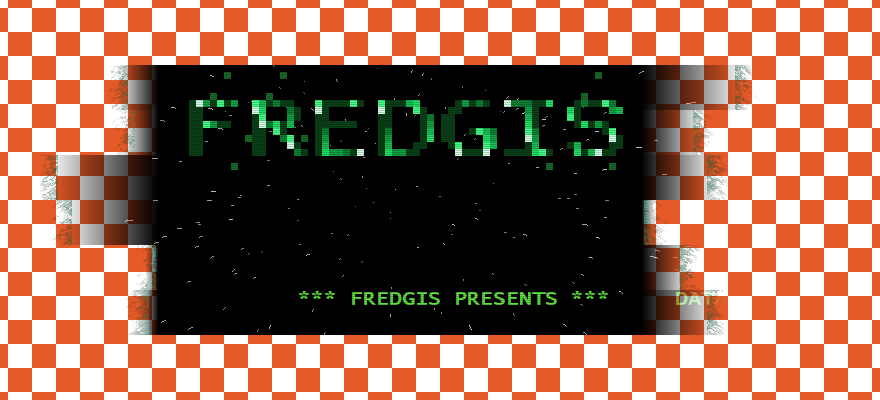

# FREDGIS

A 1990s style cracktro for Windows x64, written in **pure NASM assembly**.
No C, no CRT, no framework, no external asset: 6 144 bytes on disk, three
system DLLs, one source file.


The window is not a rectangle. It is a stack of horizontal planks whose torn
ends dissolve into real desktop transparency and smoulder with green blue
embers, and everything you see — the letters, the fire, the stars, the mask —
is rasterised by hand into a memory bitmap.

---

## Contents

| File | Purpose |
| --- | --- |
| `fredgis.asm` | The whole demo. ~1 300 lines of NASM, 23 imported symbols. |
| `tiny.ld` | Custom linker script that strips the sections mingw emits for a C runtime we do not have. |
| `build.ps1` | One command build. |
| `docs/` | Screenshots. |

---

## Build

You need [NASM](https://www.nasm.us/) and the `ld` from a **mingw-w64**
toolchain, both on `PATH`.

```powershell
.\build.ps1
```

Or by hand:

```powershell
$lib = Join-Path (Split-Path (Split-Path (Get-Command ld).Source)) "x86_64-w64-mingw32\lib"
nasm -Ox -f win64 fredgis.asm -o fredgis.o
ld -mi386pep --subsystem windows -e start -s -T tiny.ld -o fredgis.exe `
   fredgis.o "-L$lib" -lkernel32 -luser32 -lgdi32
```

`ld` is used only as a PE writer and import-table generator. Nothing from
libgcc, libmsvcrt or the mingw startup files is linked in; `start` is the raw
entry point and the process ends with `ExitProcess`.

## Run

```powershell
.\fredgis.exe
```

* **Drag anywhere** to move the window (there is no title bar).
* **Escape** to quit.

Every launch is different: the plank silhouette, the star field and the fire
are all seeded from `GetTickCount`.

---

## What is on screen



*Over a checkerboard, so you can see that the edges are genuinely transparent
rather than painted onto a background colour.*

**Plank shaped window.** Six horizontal bands of 45 pixels. Each one keeps a
118 pixel opaque core but chooses a random tip length on each side, so the
outline is ragged and never the same twice. The gradient from opaque to
invisible is a real per-pixel alpha ramp.

**Burning ends.** A Doom style fire rotated 90°, anchored to each plank tip
rather than to a fixed column, propagating outwards. A per-row heat value
random-walks every frame, which is what turns a flat glow into slow drifting
tongues. The colour is deliberately cold — `R = f/16, G = 3f/4, B = f/2`.

**Block font.** `FREDGIS` is drawn from an 8×8 bitmap font stored as bytes in
the source and scaled ×7. No `CreateFont`, no system typeface, no glyph
rasteriser: the letters are literally `mov dword [px], colour` in a loop.

**Matrix rain.** Drops fall down the columns of the logo and brighten whatever
blocks they cross, with a fading trail. The rain lives *inside* the letters —
it does not render outside their bitmap.

**Starfield.** 200 stars projected from a vanishing point with a `STAR_FOV`
focal length, each drawing a radial trail from its previous screen position.
The trails are plotted by a hand written DDA line routine (`DrawTrail`)
straight into the bitmap, which removed four GDI imports.

**Scroller and scanlines.** The message about data and AI is the one thing GDI
draws for us (`TextOutA`). Every odd row is then scaled to 205/255 for the worn
CRT feel.


---

## How it works

### The layered window pipeline

An irregular, softly faded outline cannot be done with a region
(`SetWindowRgn` is 1-bit) so the demo is a `WS_EX_LAYERED` window fed by
`UpdateLayeredWindow`. That means we own every pixel *and* every alpha value.

```
inline clear  →  TextOutA (scroller)  →  GdiFlush  →  DrawTrail (stars)
     →  logo + Matrix rain + glitch blocks  →  BurnEdges  →  AlphaPass
     →  UpdateLayeredWindow
```

The surface is a `CreateDIBSection` with `biHeight = -SCR_H` (top-down) so the
memory layout is a plain `B,G,R,A` array and a dword reads as `0x00RRGGBB`.

Two details make or break this:

1. **GDI never writes the alpha byte.** Anything `TextOutA` touches comes back
   with `A = 0`. So `AlphaPass` runs last and is the sole owner of the alpha
   channel — and it must run *after* `GdiFlush`, because GDI batches its calls
   and would otherwise overwrite pixels we already composited.
2. **Alpha must be premultiplied.** `UpdateLayeredWindow` with `ULW_ALPHA`
   expects `channel = channel * a >> 8`. `AlphaPass` special-cases `a == 0`
   (write zero) and `a == 255` (just `or` the alpha in), and does the multiply
   only on the fade ramps.

`AlphaPass` also composites the fire, adding it with the SSE `paddusb`
instruction — a saturating byte add across all four channels at once — and sets
`alpha = max(mask, fire)` so embers can glow slightly past the tear.

### Routines

| Routine | Role |
| --- | --- |
| `start` | Entry point, seeds the RNG, calls `DemoMain`, `ExitProcess`. |
| `NextRand` | 32-bit xorshift. Everything random comes from here. |
| `MakeMask` | Builds the per-row alpha mask of the planks and records each tip position for the fire. |
| `BuildLogo` / `DrawBlock` | Block font rasteriser plus the Matrix rain and glitch blocks. |
| `InitField` / `ResetStar` / `ProjectStar` / `SyncTrail` | Starfield simulation and perspective projection. |
| `DrawTrail` | DDA line plotter, replaces `MoveToEx`/`LineTo`. |
| `BurnEdges` | Sideways fire simulation at the plank tips. |
| `AlphaPass` | Scanlines, fire compositing, alpha and premultiply. |
| `DemoMain` | Window class, layered window, DIB, message loop. |
| `WndProc` | 20 ms timer tick, drag-to-move, Escape to quit. |

---

## Size

The demo is **6 144 bytes**. Getting there was mostly a fight with the PE
layout rather than with the code.

A PE file is `SizeOfHeaders` plus every section rounded up to the 512 byte file
alignment, so the real currency is *sections*, not instructions:

```
headers   0x400
.text     0xfe0  →  0x1000
.idata    0x3f4  →  0x0400
                   ------
                   0x1800  =  6144
```

What worked:

* **`tiny.ld`.** The default mingw script emits `.rdata` constructor markers,
  `.edata`, `.tls`, `.didat` and pseudo-reloc sections that a freestanding
  program has no use for. Discarding them dropped 7 168 → 6 656 bytes.
* **Fewer imports.** 28 symbols down to 23. `BitBlt` became an inline qword
  clear loop; `GetStockObject`, `SetDCPenColor`, `MoveToEx` and `LineTo` were
  replaced by `DrawTrail`. `.idata` now sits at 1 012 of its 1 024 byte budget.
* **Code diet.** Runs of `mov qword [rsp+N], 0` before the big API calls became
  `rep stosq`; the constant `SIZE`, `POINT` and `BLENDFUNCTION` structures moved
  out of the stack frame into `.text` literals; the scroll text was trimmed.
  `.text` landed at 4 064 of its 4 096 byte budget — 32 bytes of slack.

What did not work, and is worth knowing:

* **`--file-alignment 16 --section-alignment 16`** produces a 2 KB file that the
  **x64 loader refuses to run**. On x64, `SectionAlignment` must be ≥ 0x1000.
* **Merging `.idata` into `.text`** gives 2 sections and 6 144 → 5 632 bytes,
  but Windows Defender **deletes the binary on sight**: a single loaded section
  with the import table inside executable code is a textbook packer signature.
  Not worth 512 bytes.
* **Merging `.bss` into `.data`** makes the uninitialised arrays raw file
  contents. The executable went from 6 KB to **206 KB**.

CPU cost is around 0.03–0.15 s for a five second run.

---

## Notes for the curious

A few things that cost real debugging time:

* `.bss` arrays cannot be addressed as `[label + reg*4]`. NASM emits a
  32-bit absolute relocation and `ld` fails with *relocation truncated to fit*.
  Always `lea` the base into a register first.
* Random masks must be `2^n − 1`. A non power of two `and` silently ruins the
  distribution — the starfield collapsed into a cross before this was fixed.
* At function entry on x64, `rsp ≡ 8 (mod 16)`; a `push rbp` restores alignment.
  Getting this wrong crashes inside GDI, far from the actual mistake.
* Scaling *alpha* instead of *colour* in the scanline pass makes every odd row
  translucent and the whole window looks washed out over the desktop. This kind
  of bug is invisible in the source and obvious in a screenshot.

---

## License

Do whatever you want with it.
