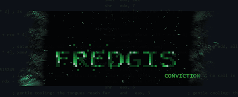
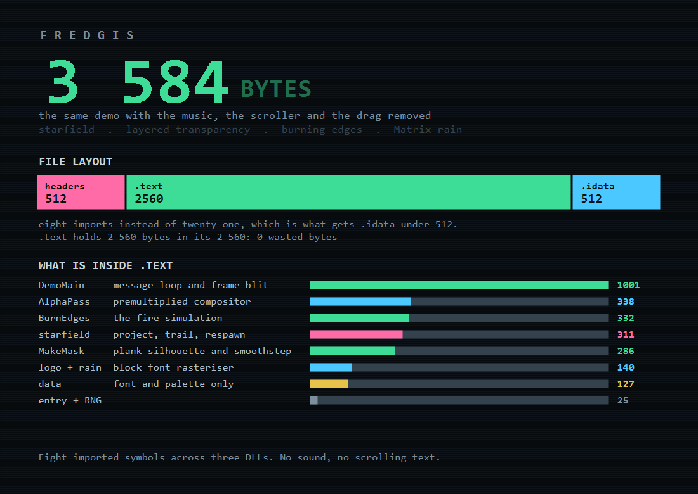
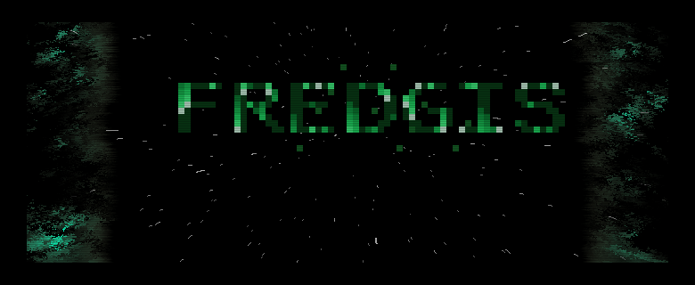
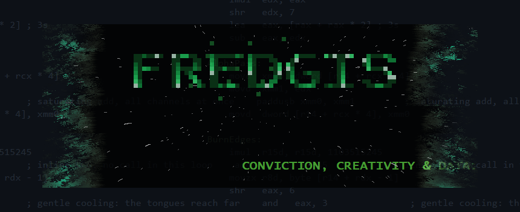
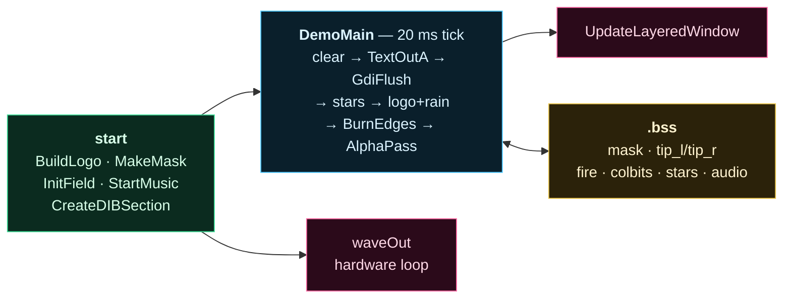
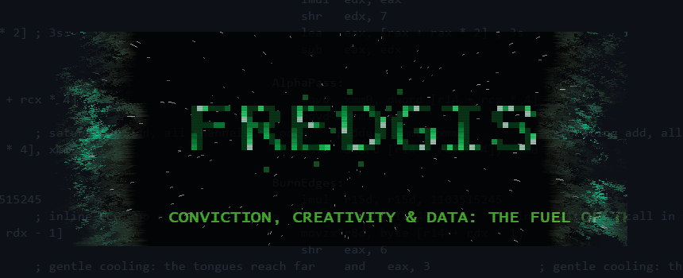
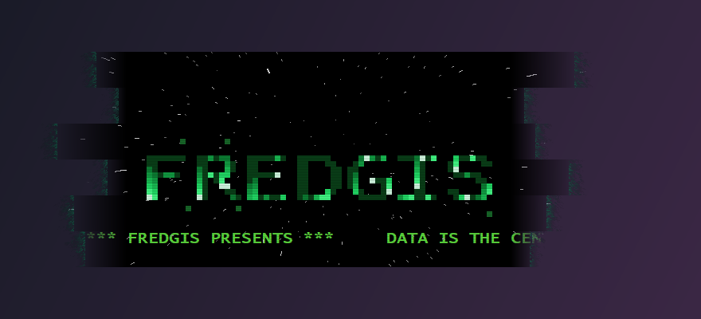
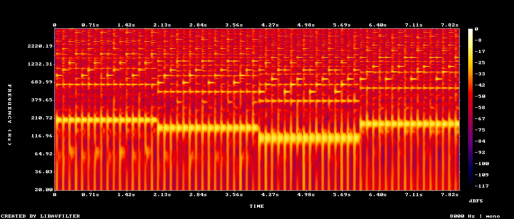

<h1 align="center">FREDGIS</h1>

<p align="center">
  <b>A 1990s cracktro for Windows x64, in pure NASM assembly.</b><br>
  <sub>no C · no runtime library · no framework · no external asset</sub>
</p>

<p align="center">
  
</p>

<p align="center">
  <a href="https://github.com/fredgis/introfredgis/releases/latest/download/fredgis.exe"><b>⬇ fredgis.exe</b> — 5 120 bytes, everything</a><br>
  <a href="https://github.com/fredgis/introfredgis/releases/latest/download/fredgis4k.exe"><b>⬇ fredgis4k.exe</b> — 3 584 bytes, no sound, no scroller</a>
</p>

<p align="center">
  <a href="docs/fredgis.mp4">video with sound</a> ·
  <a href="docs/tune.wav">soundtrack only</a> ·
  <a href="#size">how it fits</a>
</p>

---

## Two builds, one source tree

Both are the same demo. The 3 584 byte one exists because the file size is
quantised in 512 byte blocks, so shrinking the code changes nothing until a
whole block comes free — the only way down was to give up features.

| | `fredgis.asm` | `fredgis4k.asm` |
| --- | :---: | :---: |
| **size** | **5 120 bytes** | **3 584 bytes** |
| imported symbols | 21, four DLLs | 8, three DLLs |
| burning plank window, layered alpha | ✅ | ✅ |
| block logo, Matrix rain, glitch | ✅ | ✅ |
| perspective starfield with trails | ✅ | ✅ |
| 16 s chiptune | ✅ | ❌ |
| scrolling message | ✅ | ❌ |
| drag the window | ✅ | ❌ |

<p align="center">
  
</p>

<p align="center">
  
</p>

The 4 096 build is not a different program: it is the same file with
`StartMusic` removed, the GDI text gone, and the window created from the
predefined `STATIC` class so there is no `WNDCLASS` and no window procedure —
the frame is drawn straight from the message loop when `WM_TIMER` arrives.
That last change alone removes `RegisterClassA`, `DefWindowProcA` and
`DispatchMessageA`, and it is what finally drags `.idata` under 512 bytes.



---

The window is not a rectangle. It is a stack of horizontal planks whose torn
ends burn away into grey ash and green blue embers, and the whole thing is
see-through, so the desktop stays visible behind it. Every pixel — the letters,
the fire, the stars, the transparency — is rasterised by hand into a memory
bitmap, and the music is synthesised sample by sample into a byte array.

---

## Contents

| File | Purpose |
| --- | --- |
| `fredgis.asm` | The full demo. ~1 520 lines of NASM, 21 imported symbols. |
| `fredgis4k.asm` | The same demo stripped to fit 3 584 bytes. |
| `tiny.ld` | Custom linker script that discards every section the linker emits by default and that this program has no use for. |
| `pecompact.ps1` | Post link step that shrinks the padded PE header block from 512 to 0 wasted bytes. |
| `build.ps1` | One command, builds both. |
| `docs/` | Screenshots, the animated capture, the soundtrack, and the script that draws the byte budgets. |


## Build

You need [NASM](https://www.nasm.us/) and the `ld` from a **mingw-w64**
toolchain, both on `PATH`.

```powershell
.\build.ps1
```

```
fredgis.exe      5120 bytes
fredgis4k.exe    3584 bytes
```

Or by hand:

```powershell
$lib = Join-Path (Split-Path (Split-Path (Get-Command ld).Source)) "x86_64-w64-mingw32\lib"
nasm -Ox -f win64 fredgis.asm -o fredgis.o
ld -mi386pep --subsystem windows -e start -s -T tiny.ld -o fredgis.exe `
   fredgis.o "-L$lib" -lkernel32 -luser32 -lgdi32 -lwinmm
.\pecompact.ps1 -Path .\fredgis.exe
```

`ld` is used only as a PE writer and import table generator. No startup object
and no support library is linked in: `start` is the raw entry point the loader
jumps to, and the process ends with `ExitProcess`.

## Run

Grab either binary from the
[latest release](https://github.com/fredgis/introfredgis/releases/latest),
or build them yourself with the command above.

```powershell
.\fredgis.exe        # everything
.\fredgis4k.exe      # 3584 bytes, no sound and no scroller
```

* **Drag anywhere** to move the window — there is no title bar. *(full build only)*
* **Escape** to quit.

Every launch is different: the plank silhouette, the starfield and the fire are
all seeded from `rdtsc`.



---

# Architecture



There is no engine and no abstraction layer: one source file, one 20 ms loop,
and three tables of bytes that every effect reads from or writes to.

---

# How it works

## 1. The window is a bitmap, not a window

An irregular outline with *soft* edges cannot be done with a region —
`SetWindowRgn` is 1-bit, so it can only cut hard shapes. So the demo is a
`WS_EX_LAYERED` window that is never painted by `WM_PAINT`. Instead we own a
32 bpp DIB and hand it to the compositor whole:

```nasm
    call BurnEdges
    call AlphaPass

    mov rcx, qword [rsp + 80]           ; hand the surface to the compositor
    xor edx, edx
    xor r8d, r8d
    lea r9, [ulw_size]
    mov rax, qword [mem_dc]
    mov qword [rsp + 32], rax
    lea rax, [ulw_src]
    mov qword [rsp + 40], rax
    mov qword [rsp + 48], r8
    lea rax, [ulw_blend]
    mov qword [rsp + 56], rax
    mov qword [rsp + 64], ULW_ALPHA
    call UpdateLayeredWindow
```

The surface comes from `CreateDIBSection` with a **negative height**, which
makes it top-down, so the memory is a plain `B,G,R,A` array and a dword reads
naturally as `0x00RRGGBB`.

There is no double buffering, no `BitBlt` and no device context involved in
presenting: `UpdateLayeredWindow` *is* the swap.

## 2. `AlphaPass` — the compositor

This is the heart of the demo, and the two rules that govern it are easy to get
wrong:

**GDI never writes the alpha byte.** Anything `TextOutA` touches comes back with
`A = 0`. So `AlphaPass` runs last and is the sole owner of the alpha channel —
and it must run *after* `GdiFlush`, because GDI batches its calls and would
otherwise stomp on pixels we already composited.

**Alpha must be premultiplied.** `UpdateLayeredWindow` with `ULW_ALPHA` expects
`channel = channel * a >> 8`. The three channels scale by the same factor, so
they widen to words and go through a single `pmullw` rather than three
`imul`/`shr` pairs and a shift-and-`or` reassembly:

```nasm
    mov edx, dword [r14 + rcx * 4]      ; premultiply the three channels
    movd xmm1, eax
    pshuflw xmm1, xmm1, 0x40            ; the factor spread over words 0..2 and
    movd xmm0, edx                      ; left at zero in word 3, so the source
    pxor xmm2, xmm2                     ; alpha byte cannot survive the multiply
    punpcklbw xmm0, xmm2                ; and the OR below still owns it
    pmullw xmm0, xmm1
    psrlw xmm0, 8
    packuswb xmm0, xmm0
    movd edx, xmm0
    shl r10d, 24                        ; alpha keeps the untouched coverage
    or edx, r10d
    mov dword [r14 + rcx * 4], edx
```

Nothing in the demo ever reaches alpha 255. The coverage tops out at
`GLOBAL_A = 196`, which is what makes the whole window see-through:

```nasm
%define GLOBAL_A            196          ; nothing is fully solid: the desktop
                                         ; stays clearly visible through it all
```

## 3. `MakeMask` — the plank silhouette

Six planks of 45 rows. Each one picks how deep it tears on the left and on the
right, independently, so no two ends line up:

```nasm
    call NextRand
    and eax, 15
    imul eax, eax, 2                    ; 16..TIP_MAX. The spread stays small:
    add eax, 16                         ; a big one turns the stack into a
    mov r14d, eax                       ; visible staircase of black steps
```

The fade width is the constant `PLANK_FADE = 64`. Making it a power of two
turns the `t = d / fade` division into a single shift, which is the difference
between a `cdq` + `idiv` pair and one instruction:

```nasm
    cmp eax, PLANK_FADE
    jge .left_full
    shl eax, 2                          ; t = d/PLANK_FADE in 0..256, a shift
    call SmoothStep                     ; because the width is a power of two
```

The curve is **smoothstep**, `3t² − 2t³`, in fixed point. This was the third
attempt. A linear ramp is mathematically smooth but reads as a straight edge.
A plain square is *worse*: its slope is steepest exactly where it meets the
solid core, which is the hard line we were trying to remove in the first place.
Smoothstep is flat at both ends, so the plank melts into the fire with no seam:

```nasm
SmoothStep:
    mov edx, eax
    imul eax, eax
    shr eax, 8                          ; s = t^2 / 256
    imul edx, eax                       ; s * t
    shr edx, 7                          ; 2 * s * t / 256
    lea eax, [rax + rax * 2]            ; 3s
    sub eax, edx
    imul eax, GLOBAL_A
    shr eax, 8
    ret
```

It runs once, at startup, so the `call` sitting in the inner loop costs nothing
at runtime.

## 4. `BurnEdges` — the fire

A Doom style fire rotated 90°, anchored to each plank's own tip rather than to
a fixed column, propagating outwards over `FIRE_W = 176` pixels. The inner loop
runs 2 × 270 × 176 times per frame, so the RNG is inlined rather than called:

```nasm
    imul r15d, r15d, 1103515245         ; inline LCG, no call in these loops
    add r15d, 12345
```

The source is not on the tip itself. It sits `FLAME_IN = 72` pixels *inside*
the solid core, which is more than the 64 pixel alpha ramp. Putting it on the
tip leaves the whole fade region with no fire in it — a bare gradient, and your
eye reads a bare gradient as a straight edge.

Each row has its own heat that random-walks every frame. The bias matters more
than it looks:

```nasm
    and eax, 127
    sub eax, 63                         ; near unbiased walk: without this the
                                        ; rows all pin to 255 and the fire turns
                                        ; into a flat band instead of tongues
```

But an independent walk per row is *vertically uncorrelated*, which renders as
fine static. Diffusing the heat along y a little every frame builds up the
correlation that turns static into tongues of different lengths:

```nasm
    push 2
    pop r9
.smooth_pass:
    movzx r8d, byte [r10]               ; previous row, clamped at the top
    xor r12d, r12d
.smooth:
    movzx eax, byte [r10 + r12]
    lea edx, [r12 + 1]
    cmp edx, SCR_H
    jb .sm_next
    mov edx, r12d
.sm_next:
    movzx edx, byte [r10 + rdx]
    add edx, r8d
    lea edx, [rdx + rax * 2]
    shr edx, 2
    mov r8d, eax                        ; the neighbour must stay unsmoothed
    mov byte [r10 + r12], dl
```

Propagation outwards cools each step by a random amount. The mask is small
(`0..3`, so 1.5 per step on average) and it is tuned: a 255 source dies after
roughly 170 steps, just short of the 176 pixel band, so the fire fades out on
its own instead of being cut off at the boundary:

```nasm
    movzx r8d, byte [r14 + rdx - 1]     ; heat of the column one step in
    shr eax, 6
    and eax, 3                          ; gentle cooling: the tongues reach far
    sub r8d, eax
    jns .cool_ok
    xor r8d, r8d
```

The last piece, and the one that finally killed the hard edges, is that the
fire is **faded in** over its first 64 columns. Starting at full source heat on
column 0 draws a perfectly straight vertical line — a hard black to green seam
exactly where the plank body ends. Ramping the heat up instead makes the body
grade black → ash → ember with nothing straight anywhere:

```nasm
    cmp edx, FLAME_RISE                 ; fade the fire in as it comes out of
    jae .flame_lit                      ; the plank, so the body grades from
    imul eax, edx                       ; black to ash to ember instead of
    shr eax, FLAME_RISE_LOG             ; meeting the flames on a straight line
.flame_lit:
    lea eax, [rax + rax * 2]            ; +50%: the fade in costs brightness and
    shr eax, 1                          ; the embers have to read as fire
    cmp eax, 255
    jbe .flame_ok
    mov eax, 255
.flame_ok:
```



### Ash and embers from one number

The fire is a single 0..255 heat value, but it has to look like two things at
once: **charcoal smoke** where the plank frays, melting into **green blue
embers** where it burns. That is just a colour ramp where red dies out as the
heat rises:

```nasm
    mov edx, 255                        ; the cold tail reads as ash: R ~ G ~ B
    sub edx, eax                        ; so the tips end in grey black smoke
    imul edx, eax                       ; that melts into the green blue core
    shr edx, 8
    shl edx, 16
    lea r8d, [rax + rax * 2]            ; B = 3f/4
    shr r8d, 2
    or edx, r8d
    mov r8d, eax                        ; G = f
    shl r8d, 8
    or edx, r8d
```

| heat | R | G | B | reads as |
| --- | --- | --- | --- | --- |
| 30 | 26 | 30 | 22 | dark grey ash |
| 80 | 54 | 80 | 60 | grey green |
| 180 | 52 | 180 | 135 | ember |
| 255 | 0 | 255 | 191 | bright green blue |

Compositing is a single SSE instruction — a saturating byte add across all four
channels at once — and the coverage becomes `max(mask, heat)`, so embers glow
slightly past the tear and the silhouette itself ends in flame:

```nasm
    movd xmm0, dword [r14 + rcx * 4]    ; saturating add over all channels
    movd xmm1, edx
    paddusb xmm0, xmm1
    movd dword [r14 + rcx * 4], xmm0
```

## 5. The block font

`FREDGIS` is not drawn with a typeface. It is seven bytes-per-row glyphs stored
in the source and scaled ×7 straight into the DIB:

```nasm
; Block font, 8x8 per letter, most significant bit on the left. Only the seven
; letters of the name are stored.
glyph_data:
    db 0xFE, 0xC0, 0xC0, 0xFC, 0xC0, 0xC0, 0xC0, 0xC0   ; F
    db 0xFC, 0xC6, 0xC6, 0xFC, 0xD8, 0xCC, 0xC6, 0xC3   ; R
    db 0xFE, 0xC0, 0xC0, 0xFC, 0xC0, 0xC0, 0xC0, 0xFE   ; E
    db 0xFC, 0xC6, 0xC3, 0xC3, 0xC3, 0xC3, 0xC6, 0xFC   ; D
    db 0x3E, 0x60, 0xC0, 0xC0, 0xCF, 0xC3, 0x63, 0x3E   ; G
    db 0xFE, 0x18, 0x18, 0x18, 0x18, 0x18, 0x18, 0xFE   ; I
    db 0x7E, 0xC3, 0xC0, 0x7C, 0x06, 0x03, 0xC3, 0x7E   ; S
```

`BuildLogo` transposes that into `colbits`, one dword per logo column, so the
Matrix rain can ask "is there a block at column `x`, row `y`?" with a single
`bt`.

## 6. Matrix rain inside the letters

The drops only light up blocks that belong to a letter — the rain lives
*inside* the logo, it never renders outside it. Drop heads are tracked in 1/64
of a block row so they can fall at fractional speeds, and the trail is four
palette entries deep:

```nasm
    mov eax, dword [rbx + RN_Y]
    sar eax, 6                          ; head, in block rows
    sub eax, r13d
    js .rain_next
    cmp eax, GLYPH_ROWS
    jae .rain_next
    lea rcx, [colbits]
    mov ecx, dword [rcx + r12 * 4]
    bt ecx, eax                         ; is there a block here at all?
    jnc .rain_next
```

```nasm
; Rain palette, 0x00RRGGBB: bright head then a fading tail.
level_col     dd 0x00D8FFE8, 0x0044FF88, 0x0022E068, 0x001AC055
```



## 7. Starfield, scroller, scanlines

200 stars are projected from a vanishing point with a `STAR_FOV` focal length,
each drawing a radial trail from its previous screen position. The trails are
plotted by a hand written DDA (`DrawTrail`) straight into the bitmap, which
removed four GDI imports.

The scrolling message is the one thing GDI still draws for us, with `TextOutA`.
Every odd row is then scaled to `205/255` for the worn CRT feel — **colour
only, never alpha**, or half the window would go see-through.

## 8. `StartMusic` — the chiptune

A cracktro without music is a screensaver. The soundtrack is generated, not
loaded: an 8 kHz, 8 bit, mono PCM buffer of exactly sixteen seconds is rendered
into `.bss` at startup and then handed to the mixer **on an infinite hardware
loop**, so the demo spends zero instructions per frame on audio.

```nasm
    lea rbx, [wave_hdr]                 ; one base for the whole header
    mov dword [rbx + 24], 0x0C          ; WHDR_BEGINLOOP | WHDR_ENDLOOP
    mov dword [rbx + 28], -1            ; and never stop looping
```

That trick is what keeps it cheap: no callback, no streaming thread, no double
buffering. Three imports (`waveOutOpen`, `waveOutPrepareHeader`,
`waveOutWrite`), called once, and the tune runs itself for the rest of the
process lifetime. If `waveOutOpen` fails the demo simply runs silent.

Three voices, which is exactly what the hardware being imitated had:

| voice | waveform | role |
| --- | --- | --- |
| bass | 50 % square | root of the chord, replucked every row |
| lead | 25 % pulse | arpeggio, one chord tone per row |
| hat | noise burst | short decaying click on the off rows |

Pitch is a phase accumulator. A note is packed as `(octave << 4) | semitone`,
because going up an octave is doubling the frequency, which is shifting the
increment left — so one twelve entry table covers the whole keyboard:

```nasm
note_incr     dw 536, 568, 601, 637, 675, 715, 758, 803, 851, 901, 955, 1011

NoteIncr:
    mov eax, ecx
    and eax, 15                         ; semitone picks the table entry,
    lea rdx, [note_incr]                ; octave is a shift: doubling the
    movzx ebx, word [rdx + rax * 2]     ; frequency is doubling the increment
    shr ecx, 4
    shl ebx, cl
    ret
```

The song is 24 bytes: four chords, `Am F C G`, two seconds each, four arpeggio
notes per chord, then a per-part octave offset.

```nasm
arp_tab       db 0x39, 0x40, 0x44, 0x49
              db 0x35, 0x39, 0x40, 0x45
              db 0x30, 0x34, 0x37, 0x40
              db 0x37, 0x3B, 0x42, 0x47
bass_tab      db 0x19, 0x15, 0x10, 0x17

part_lead     db 0, -16
part_bass     db 0, -16
```

Those last four bytes are the whole structure: the first eight seconds play it
straight, the second eight drop an octave and walk the arpeggio backwards, then
it loops. Nothing goes *up* — at 8 kHz the Nyquist limit is 4 kHz, and an
octave above this lead put the pulse harmonics on the wrong side of it, which
sounds like noise rather than a lead break.

The one thing that separates a tracker from an organ is the envelope. Every
note decays linearly across its own row, so each one has an attack:

```nasm
    mov r9d, r10d
    shr r9d, 2
    mov r8d, 250                        ; linear pluck: every note decays over
    sub r8d, r9d                        ; its own row, so the tune has attack
    jns .env_ok
    xor r8d, r8d
.env_ok:
```

A spectrogram of the rendered buffer shows the whole structure falling out of
it — the bass stepping 220 → 175 → 131 → 196 Hz for eight seconds, the same
progression an octave down for the next eight, the arpeggio above it, and the
vertical striations of one pluck every 125 ms:



---

# Frame order

```
inline clear  →  TextOutA (scroller)  →  GdiFlush  →  DrawTrail (stars)
   →  logo + Matrix rain + glitch blocks  →  BurnEdges  →  AlphaPass
   →  UpdateLayeredWindow
```

A `SetTimer` at 20 ms drives it. CPU cost is around 0.05–0.25 s for a five
second run.

# Routines

| Routine | Role |
| --- | --- |
| `start` | Entry point, seeds the RNG, calls `DemoMain`, `ExitProcess`. |
| `NextRand` | 32-bit LCG, high bits only. Everything random comes from here. |
| `MakeMask` | Per-row alpha mask of the planks; records each tip so the fire knows where to burn. |
| `SmoothStep` | `3t² − 2t³` in fixed point, the curve that melts the plank ends into the fire. |
| `BuildLogo` / `DrawBlock` | Block font rasteriser, Matrix rain and glitch blocks. |
| `InitField` / `ResetStar` / `ProjectStar` / `SyncTrail` | Starfield simulation and perspective projection. |
| `DrawTrail` | DDA line plotter, replaces `MoveToEx` / `LineTo`. |
| `BurnEdges` | Sideways fire simulation at the plank tips. |
| `NoteIncr` / `StartMusic` | Chiptune synthesis and the looping `waveOut` buffer. |
| `AlphaPass` | Scanlines, fire compositing, alpha and premultiply. |
| `DemoMain` | Window class, layered window, DIB, message loop. |
| `WndProc` | 20 ms timer tick, drag to move, Escape to quit. |

---

<a name="size"></a>

# Size

The demo is **5 120 bytes**, sound included. Getting there was a fight with the
PE layout at least as much as with the code.

A PE file is `SizeOfHeaders` plus every section rounded up to the 512 byte file
alignment, so the real currency is *blocks*, not instructions:

```
headers   0x0200                        (448 of 512 used)
.text     0x0E00  →  0x0E00             (3584 of 3584 used)
.idata    0x03DC  →  0x0400             ( 988 of 1024 used)
                     ------
                     0x1400  =  5120
```


## The journey

| | bytes | what changed |
| --- | ---: | --- |
| first working build | 7 168 | default linker script, 28 imports |
| `tiny.ld` | 6 656 | discard the sections a freestanding program never uses |
| import and code diet | 6 144 | 28 symbols → 23, `BitBlt` and the GDI line API replaced by hand written loops |
| **+ 16 s chiptune** | 7 168 | `.text` crossed 0x1000 and `winmm` pushed `.idata` past 0x400: two blocks |
| optimisation pass | 6 656 | five imports deleted outright |
| optimisation pass | 6 144 | interleaved records, hoisted bases, dead fast paths removed |
| `pecompact.ps1` | 5 632 | the padded header block |
| instruction & layout diet | **5 120** | `.text` drops under 3 584 (7 blocks) |

The graphics-only demo was 6 144 bytes. It now has a soundtrack **and** is
512 bytes smaller than it was without one.

## What actually moved the needle

**1. Deleting imports, not instructions.** `.idata` was 1 176 bytes, a mere 152
over a block boundary. Five imports had to go, and each one had a replacement
that was smaller than the call it removed:

| removed | replaced by |
| --- | --- |
| `GetTickCount` | `rdtsc` — two bytes, and a better seed |
| `GetTextExtentPoint32A` | Lucida Console is fixed pitch, so the scroller width is `scroll_len * 13` at assembly time |
| `LoadCursorA` | a NULL `hCursor`: the pointer simply keeps the shape it had |
| `DestroyWindow`, `PostQuitMessage` | Escape calls `ExitProcess` directly. There is nothing to tear down |

That single change was worth 512 bytes of file.

**2. Interleaving the tables.** The stars used to be seven parallel arrays, so
every field access needed a seven byte `lea` of an absolute label — `.bss`
arrays cannot be written as `[label + reg*4]`, NASM emits a relocation `ld`
refuses. Turning them into one 32 byte record walked by a pointer turned every
access into a displacement:

```nasm
SyncTrail:                              ; was 45 bytes of lea, now 9
    mov rax, qword [rbx + ST_SX]
    mov qword [rbx + ST_PX], rax
    ret
```

There were 72 of those `lea`s in the source, 504 bytes of pure addressing.

Worth noting that this is the *opposite* of what every performance guide tells
you. Structure-of-arrays is the layout that feeds SIMD and keeps cache lines
dense; array-of-structures is the one that keeps instruction encodings short.
Optimising for bytes and optimising for cycles pull in different directions,
and here bytes won — measured cost of the whole demo afterwards: **3 % of one
core**.

**3. Hoisting bases into spare registers.** `rbp` is a frame pointer by habit,
not by need. `AlphaPass` and `StartMusic` both address everything through
`rsp`, so `rbp` was free to hold a table base — and because the four tune
tables are laid out back to back, one base reaches all of them:

```nasm
    lea rbp, [arp_tab]                  ; the four tables are laid out back to
    ...                                 ; back, so one base reaches all of them
    movzx ecx, byte [rbp + r9 + (bass_tab - arp_tab)]
    movsx edx, byte [rbp + r8 + (part_bass - arp_tab)]
```

**4. Deleting fast paths that were not faster.** `AlphaPass` had two shortcuts:
one for fully transparent pixels, one for fully opaque ones. Working through
the arithmetic, the general path produces *exactly* the same bytes in both
cases — coverage 0 premultiplies every channel to zero, coverage 255 leaves the
pixel within one 255ths of itself. Twenty-eight bytes of code for nothing. That
deletion is what put `.text` at 4 096 on the nose.

**5. The padded header block.** `ld` sets `SizeOfHeaders` to 0x400 even though
the DOS stub, the COFF and optional headers and the three section headers all
end at 0x200. That is a full alignment block of zeroes in the middle of the
file. `pecompact.ps1` rewrites `SizeOfHeaders`, pulls every section's
`PointerToRawData` down by 512 and drops the padding. Nothing exotic: plenty of
linkers emit 0x200 to begin with.

## Where it stops

`.text` holds 3 584 bytes in a 3 584 block and `.idata` 988 in a 1 024 block.
Because the file is quantised in 512 byte steps, **shaving another twenty or
fifty bytes changes nothing at all** — the next gain needs a whole block.

That is exactly what `fredgis4k.asm` proves, in both directions. The cheap
tricks do not get you there:

| | result |
| --- | --- |
| shorten the scroll text to nothing | −55 bytes, **file unchanged** |
| drop the high octave from the tune | −16 bytes, **file unchanged** |
| apply every peephole idiom left | under 100 bytes, **file unchanged** |
| `rep stosd` block fill and a SIMD premultiply | −32 in `.text`, **file unchanged** |
| drop music + scroller + drag + window class | −1008 in `.text`, −520 in `.idata`, **file 5 120 → 3 584** |

The measured floor for `.idata` is the interesting part. Eleven imports — the
smallest set that still creates a layered window and blits it — assembles to
**584 bytes**, which still rounds up to a 1 024 block. It only drops to **468**,
and therefore into a 512 block, once the predefined `STATIC` class removes
`RegisterClassA` and `DefWindowProcA`, and drawing from the message loop
removes `DispatchMessageA`.

So the question was never "how many characters do I cut" but "which effect do
I give up". Both answers now live in the repo.

Working through chapter 10 of Agner Fog's
[*Optimizing subroutines in assembly language*](https://www.agner.org/optimize/optimizing_assembly.pdf)
and the size-specific tricks from
[Bartosz Wójcik's write-up](https://dev.to/bartosz/assembly-code-size-optimization-tricks-2abd),
most of the classic peephole set was already in place — there is not a single
`mov reg, 0` or `cmp reg, 0` left in the source. What remained:

| technique | status |
| --- | --- |
| `push imm8` / `pop r64` instead of `mov r32, imm` | **applied**, 11 sites, **16 bytes measured** |
| `xor`/`test` instead of `mov 0`/`cmp 0` | already everywhere, 0 sites left |
| `cdq` instead of `xor edx, edx` | 6 bytes, needs `eax ≥ 0` proved at each site — not taken |
| avoiding REX by never touching `r8`–`r15` | 213 bytes, and unreachable |
| not using `rbp` as a base register with no displacement | 3 bytes |

The REX figure is a hard ceiling, not a plan: it assumes the whole program fits
in the seven usable legacy registers, and `AlphaPass` alone keeps eight values
live. Everything realistically left is **under a hundred bytes**, against 480
for a block — and the 16 bytes that *were* taken moved `.text` from 4 064 to
4 048 and the file not at all.

Two things in Agner's chapter are worth reading the other way round, because
they are what the pass above was already doing without knowing it: *"instructions
with pointers take one byte less when they have only a base pointer and a
displacement than when they have a scaled index register"* — that is the
interleaved record change — and *"64-bit code does not need more bytes for
addresses than 32-bit code because it can use 32-bit RIP-relative addresses"*.

## What did not work, and is worth knowing

* **`--file-alignment 16 --section-alignment 16`** produces a 2 KB file that the
  **x64 loader refuses to run**. On x64, `SectionAlignment` must be ≥ 0x1000.
* **Merging `.idata` into `.text`** saves nothing once the arithmetic is done,
  and Windows Defender **deletes the binary on sight**: a single loaded section
  with the import table inside executable code is a textbook packer signature.
* **A self decompressing build** would fit in about 4 608 bytes, and would be
  flagged by every heuristic scanner for exactly the same reason. Not worth it.
* **Merging `.bss` into `.data`** turns the uninitialised arrays into raw file
  contents. The executable went from 6 KB to **206 KB**.

---

# Notes for the curious

A few things that cost real debugging time:

* `.bss` arrays cannot be addressed as `[label + reg*4]`. NASM emits a 32-bit
  absolute relocation and `ld` fails with *relocation truncated to fit*. The
  base has to go through a register first — which is what eventually pushed the
  whole design towards interleaved records.
* **`rsi` and `rdi` are non-volatile on Windows.** Every System V reference you
  will find lists them as scratch, and they are — on Linux. Under the
  [Microsoft x64 convention](https://learn.microsoft.com/en-us/cpp/build/x64-calling-convention)
  the non-volatile set is `rbx, rbp, rdi, rsi, rsp, r12-r15`, and `WndProc` is
  called by the system, so anything it touches has to come back. Freeing `rbp`
  as a general register during the size pass meant re-checking all of it:
  every prologue push, 16-byte alignment at each call site, and the 32-byte
  shadow store the *caller* has to reserve.
* Random masks must be `2^n − 1`. A non power of two `and` silently ruins the
  distribution; the starfield collapsed into a cross before this was fixed.
* At function entry on x64, `rsp ≡ 8 (mod 16)`; a `push rbp` restores alignment.
  Getting this wrong crashes deep inside GDI, far from the actual mistake.
* At 8 kHz, anything above 4 kHz folds back. An octave too high turned the lead
  into noise, which is why the tune goes *down* for its second half instead of up.
* Scaling *alpha* instead of *colour* in the scanline pass makes every odd row
  translucent and the whole window looks washed out. This class of bug is
  invisible in the source and obvious in a screenshot — most of the visual work
  here was done by looking at captures, not at code.

# License

Do whatever you want with it.
